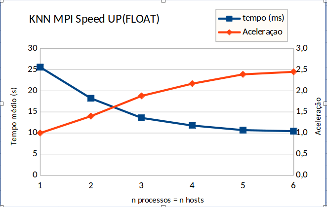

# Determinar conjuntos de K vizinhos mais próximos (KNN) com processos MPI
- O relatório do projeto em versão PDF se encontra no path docs/Relatorio.pdf 
- Para executar o programa, basta digitar o comando ```source scripts/sbatch-runner.sh ``` e digitar a quantidade de processos MPI desejadas para o teste. 

## Integrantes
* Rubens Zandomenighi Laszlo GRR20206147
* Gabriel Razzolini Pires De Paula GRR20197155

## Visão geral    
Dado um número inteiro k. Para cada ponto em Q, queremos determinar quais são seus k vizinhos mais próximos no conjunto P. Utilizamos as funções do MPI Scatter, Gather e Broadcast. 
- Scatter: Utilizamos essa função para que cada processo MPI lide com um subconjuntos de pontos, Q_Local. 
- Broadcast: Utilizamos essa função para transmissão a todos os processos MPI do conjunto de pontos P, visto que todos os processos MPI devem conhecer todos os pontos do conjunto P. 
- Gather: Após a execução da função knn, utilizamos essa função para armazenar na variável result_indices os resultados obtidos a partir da função knn na variável local_result_indices.  

## Implementação da função knn
Conforme a partição do conjunto de pontos Q para os processos MPI, realizada pela função **Scatter**, na função **knn**, para cada processo MPI, utilizamos um conjunto de vizinhos mais próximos para as linhas que esse processo MPI deve lidar, tal como no trecho abaixo:   
```
pair_t neighbors[local_nq][k];
```
- **local_nq**: Número de Linhas de Q_local do processo MPI.
- **k**: Quantidade de vizinhos, sendo que para cada processo MPI, utilizamos conjuntos de pontos de local_nq x K pontos (armazendo os índices); 
- **neighbors**: Utilizamos essa variável como pair_t** definido anteriormente, para as utilizações das funções de heaps (insert e decreaseMax). Sendo que para cada linha de Q_local é criada uma heap que trata dos k vizinhos mais próximos dessa linha.
<br>
- Após a execução das operações de decreaseMax para o D(número de dimensões) - k(total de pontos inseridos para inicialização das heaps de pontos). Fazemos a concatenação de todas as heaps de índices obtidas na matriz de resultados **result_indices**.  

## Corretude dos resultados 
Para a verificação dos resultados do programa, implementamos as seguintes funções: 
- **generate_expected_results**: Gera os resultados esperados dados um conjunto de pontos e um dataset, utilizando a função de distância euclidiana e qsort para ordenação dos vizinhos.
- **verify_results**: Utiliza a função declarada acima para verificação de divergências entre o conjunto de pontos gerados pela função que efetua KNN utilizando max-heaps e utilizando qsort. 

Compilando com a pré-diretiva _make debug_ é possível visualizar os resultados obtidos, tais como a impressão dos conjuntos de pontos de P e Q, como também os conjuntos de pontos Q_locais obtidos por cada processo MPI (através da chamada MPI_Scatter). Após isso, os resultados de KNN calculados através da função **generate_expected_results** e também dos calculados pela função **knn**. 


## Scripts
Para a melhor visualização dos resultado, além das experiências especificas, efetuamos um script para que efetue o loop desde 1 até o número de nodos disponíveis, assim tendo uma maior distribuição para a contagem do speed up da experiência do MPI, como mostrado no gráfico da seção de resultados. 

- knn-mpi-runner.sh: Script que executa o programa utilizando a entrada especificada de: 128 400000 300 1024. 
- sbatch-runner.sh: Script que executa sbatch $NUM_NODOS. 

## Resultados obtidos
- As experiências foram executadas no cluster XEON e os hosts utilizados para as experiências estão descritos nos outputs, conforme a experiência executada, sendo esse com 6 hosts disponíveis para as experiências desse projeto. 
- Outputs: Os outputs gerados pelo programa foram salvos na pasta output no padrão knn_$NUM_PROCESS-processes_$NUM_HOSTS-host.out. 
- Além das experiências especificadas, efetuamos experiências para geração do seguindo gráfico, que ilustra os resultados obtidos conforme o aumento de números de hosts, como também pelo aumento de processos MPI executados. 
- Conforme as experiências, verificamos o aumento contínuo de speed up, comparando os resultados obtidos conforme o aumento de Hosts, visto que cada host trata de um conjunto de pontos locais através da função **Scatter**, e somente após a execução de knn para esses conjuntos locais, utilizamos a função **Gather** para juntar os resultados obtidos em um conjunto 'global' de índices obtidos.



- O resultado para as três experiências especificadas, além das experiências explicadas acimas, estão disponíveis no path docs/Planilha-resultados. 
- Medimos os resultados conforme a entrada especificada de 1.024 vizinhos mais próximos de 128 pontos de 300 dimensoes em base de dados de 400.000 pontos, relatando abaixando o speed up de cada experiência.

### Experiencia 1: Tempo da computação 1 processo MPI
- Tempo base: 25,597040 s
### Experiencia 2: Tempo da computação de 4 processos MPI no mesmo host
- Speed up com relação ao tempo base(sequencial): 2,20
### Experiencia 3: Tempo da computaçao 4 processos MPI em hosts diferentes
- Speed up com relação ao tempo base(sequencial): 2,17
### Experiência 4: Speed up conforme aumento de processos MPI e aumento de hosts
- Conforme o aumento do número de processos obtivemos em média 2,06 de speed up conforme o aumento de processos MPI. 
